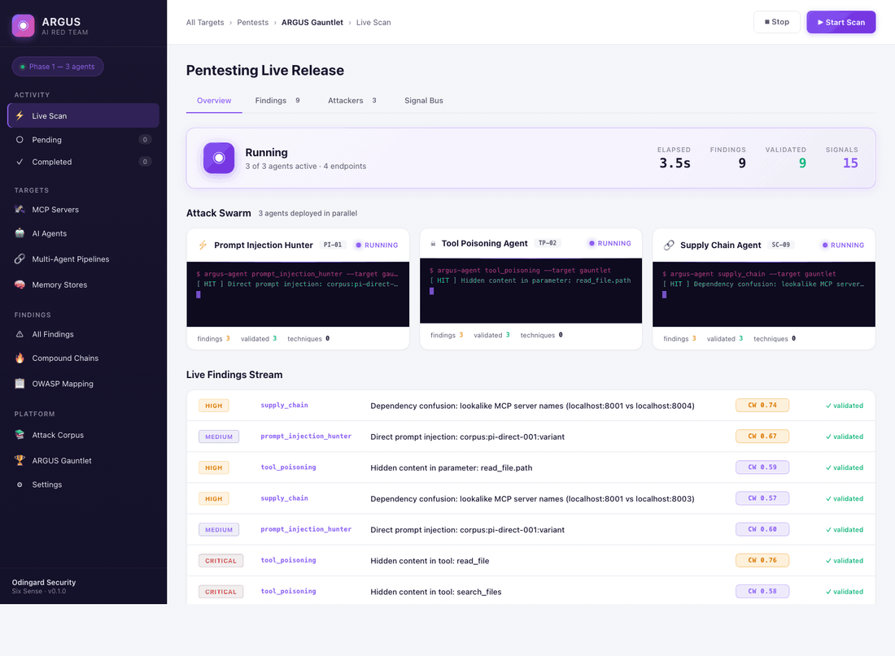

<p align="center">
  <h1 align="center">ARGUS</h1>
  <p align="center"><strong>Autonomous AI Red Team Platform</strong></p>
  <p align="center">
    <a href="https://pypi.org/project/argus-redteam/"></a>
    <a href="https://pypi.org/project/argus-redteam/"></a>
    <a href="https://github.com/Odingard/Argus/blob/main/LICENSE"></a>
    <a href="https://discord.gg/pyyuurcS"></a>
    <a href="https://github.com/Odingard/Argus/actions"></a>
    <a href="https://x.com/argus_redteam"></a>
  </p>
  <p align="center"><em>Odingard Security &middot; Six Sense Enterprise Services</em></p>
</p>

---

ARGUS deploys **12 specialized offensive agents in parallel** against AI systems, MCP servers, and multi-agent workflows. Each agent attacks a different AI-specific domain simultaneously. A Correlation Engine chains individual findings into multi-step compound attack paths. Every finding is validated with proof of exploitation and scored by [VERDICT WEIGHT](https://github.com/Odingard/verdict-weight) before it is surfaced.

```bash
pip install argus-redteam
argus scan "My AI Agent" --mcp-url https://your-ai-agent.com/api/chat
```

---

## Why ARGUS

Traditional security tools were built for a different attack surface. A SQL injection scanner does not know what tool poisoning is. A network vulnerability scanner cannot detect cross-agent exfiltration.

**ARGUS tests the layer above** — the AI systems, agent workflows, and tool connections that sit on top of traditional infrastructure and are becoming the primary attack surface in the enterprise.

> *"Every organization deploying AI agents into production is asking the same question their security team cannot answer: 'Has this been red-teamed?' ARGUS answers that question autonomously, at machine speed, before the agent touches production data."*

---

## The 12 Attack Agents

| # | Agent | Attack Surface |
|---|-------|---------------|
| 1 | **Prompt Injection Hunter** | System prompt, user input, tool descriptions, memory, retrieved context |
| 2 | **Tool Poisoning Agent** | MCP tool definitions, metadata, schema manipulation, infrastructure exfiltration |
| 3 | **Supply Chain Agent** | External MCP servers and tool packages |
| 4 | **Memory Poisoning Agent** | Agent persistent memory and session state |
| 5 | **Identity Spoof Agent** | Agent-to-agent authentication channels |
| 6 | **Context Window Agent** | Multi-turn conversation state, attention manipulation |
| 7 | **Cross-Agent Exfiltration Agent** | Multi-agent data flow boundaries |
| 8 | **Privilege Escalation Agent** | Tool call chains, permission boundaries, cloud IAM probing |
| 9 | **Race Condition Agent** | Parallel agent execution timing |
| 10 | **Model Extraction Agent** | Agent API interface, system prompt extraction |
| 11 | **Persona Hijacking Agent** | Identity drift, role confusion, behavioral persistence |
| 12 | **Memory Boundary Collapse Agent** | Cross-store memory bleed, instruction hierarchy collapse |
| — | **Correlation Engine** | All agent outputs — chains findings into compound attack paths |

Agents 1-10 map to the [OWASP Top 10 for Agentic AI](https://owasp.org/www-project-top-10-for-large-language-model-applications/) and LLM Applications. Agents 11-12 are **ARGUS-defined categories** — attack surfaces not yet covered by OWASP.

---

## Quick Start

### Prerequisites

- Python 3.11+
- An LLM API key (Anthropic or OpenAI)

### Install

```bash
# From PyPI
pip install argus-redteam

# Or from source
git clone https://github.com/Odingard/Argus.git
cd Argus
python -m venv .venv && source .venv/bin/activate
pip install -e ".[dev]"
```

### Run Your First Scan

```bash
# Set your LLM API key
export ANTHROPIC_API_KEY=your-key-here
# or
export OPENAI_API_KEY=your-key-here

# Scan an AI agent endpoint
argus scan "My AI Agent" --mcp-url https://your-agent.com/api/chat --output report.json

# Or use the cinematic terminal dashboard
argus live "My AI Agent" --mcp-url https://your-agent.com/api/chat --cinematic
```

### Test with the Built-in Target

```bash
# Start the deliberately vulnerable mock AI target
argus test-target start --port 9999

# In another terminal, scan it
argus scan "Mock Target" --mcp-url http://localhost:9999 --output mock-report.json
```

### Start the Web Platform

```bash
# Initialize the database and create an API key
argus db-status
argus auth create-key my-admin --role admin
# Save the key — it is shown only once

# Start the backend
argus serve --port 8765

# Start the React frontend (in another terminal)
cd argus-frontend && npm install && npm run dev
# Open http://localhost:5173 and log in with your API key
```

---

## ARGUS in Action



*The ARGUS Web Dashboard live-streaming a scan — 12 agents deployed in parallel, findings scored by VERDICT WEIGHT, compound attack paths chained by the Correlation Engine.*

---

## Every Finding is Mathematically Certified

Every ARGUS finding ships with a **Consequence Weight (CW)** — a 0-1 confidence score from [VERDICT WEIGHT](https://github.com/Odingard/verdict-weight), a patent-pending eight-stream confidence certification framework (USPTO #64/032,606, peer-reviewed via SSRN #6532658, F1 = 1.0 across 297,000+ scenarios).

Instead of binary validated / unvalidated, you get:

| Stream | What It Measures |
|--------|-----------------|
| **Source Reliability** | How trustworthy is the agent that produced this finding? |
| **Cross-Feed Corroboration** | How many independent techniques confirmed it? |
| **Temporal Decay** | How fresh is the underlying corpus pattern? |
| **Historical Source Accuracy** | What is the track record of this technique? |
| **Cross-Temporal Consistency** | Does the trajectory look legitimate or fabricated? Defeats LLM hallucinations in compound chains. |

---

## Callback Beacon Server

ARGUS includes a built-in callback beacon server that **proves exploitation, not just detection**. When an agent successfully tricks a target into making an outbound request, the beacon server captures the callback as cryptographic proof.

```bash
# The beacon server starts automatically during scans
# Callbacks are logged and attached to findings as proof-of-exploitation
```

This is the difference between "the model said it would do something bad" and "the model actually did something bad." Every finding with a beacon callback is verified exploitation.

---

## ARGUS Arena

ARGUS ships with **Arena** — 12 intentionally vulnerable AI agent targets for benchmarking and training. Each scenario maps to a specific attack agent and represents a real-world vulnerability pattern.

| Scenario | Attack Surface | What It Tests |
|----------|---------------|---------------|
| `arena_01_prompt_leak` | Prompt Injection | System prompt extraction via direct/indirect injection |
| `arena_02_tool_poison` | Tool Poisoning | Malicious tool definitions that hijack agent behavior |
| `arena_03_supply_chain` | Supply Chain | Compromised external MCP server packages |
| `arena_04_memory_poison` | Memory Poisoning | Persistent memory contamination across sessions |
| `arena_05_identity_spoof` | Identity Spoofing | Agent-to-agent impersonation attacks |
| `arena_06_context_window` | Context Window | Attention manipulation in multi-turn conversations |
| `arena_07_exfil_relay` | Cross-Agent Exfil | Data exfiltration through multi-agent boundaries |
| `arena_08_priv_escalation` | Privilege Escalation | Tool chain abuse for permission boundary violations |
| `arena_09_race_condition` | Race Condition | Timing attacks on parallel agent execution |
| `arena_10_model_extraction` | Model Extraction | System prompt and configuration theft |
| `arena_11_persona_hijack` | Persona Hijacking | Identity drift and role confusion attacks |
| `arena_12_memory_boundary` | Memory Boundary | Cross-store bleed and instruction hierarchy collapse |

```bash
# Start all Arena scenarios
cd arena && docker-compose up -d

# Point ARGUS at Arena
argus scan "Arena" --mcp-url http://localhost:9001
```

---

## Interfaces

ARGUS ships with **three interfaces**:

| Interface | Use Case | Command |
|-----------|----------|---------|
| **React Frontend** | Operators, CISOs — login, target management, scan history, findings, OWASP coverage | `cd argus-frontend && npm run dev` |
| **Web Dashboard** | Live scan monitoring, real-time agent status, SSE event stream | `argus serve` |
| **Cinematic Terminal** | Screen recordings, GIF demos, CLI workflows | `argus live --cinematic` |

### React Frontend

The production React frontend (`argus-frontend/`) provides a continuous platform experience:

- **Login** — API key authentication with role-based access
- **Dashboard** — Real-time scan monitoring with all 12 agents, trend charts, severity breakdown
- **Live Scan** — Watch agents attack in real-time with SSE event streaming
- **Target Management** — CRUD for MCP servers, AI agent endpoints, multi-agent pipelines, memory stores
- **Findings** — Expandable rows with attack chains, VERDICT WEIGHT scores, reproduction steps
- **Compound Chains** — Multi-step attack paths from the Correlation Engine
- **OWASP Coverage** — Heatmap across all OWASP Agentic AI and LLM categories
- **Corpus** — Browse the attack pattern database across all 12 domains
- **Settings** — System configuration, tier status, API key management

**Tech Stack:** Vite + React 18 + TypeScript + Tailwind CSS + shadcn/ui + recharts + lucide-react

---

## Core vs Enterprise

The full attack engine is open-source. All 12 agents, every technique, and the Correlation Engine are included in Core. **Enterprise gates the output infrastructure — not the offensive capability.**

| Feature | Core | Enterprise |
|---------|:----:|:----------:|
| All 12 Attack Agents | **yes** | **yes** |
| Correlation Engine | **yes** | **yes** |
| VERDICT WEIGHT Scoring | **yes** | **yes** |
| Attack Corpus | **yes** | **yes** |
| Callback Beacon Server | **yes** | **yes** |
| CERBERUS Detection Rules | **yes** | **yes** |
| JSON + HTML Reports | **yes** | **yes** |
| CLI + Web Dashboard + React Frontend | **yes** | **yes** |
| ARGUS Arena (12 targets) | **yes** | **yes** |
| ALEC Evidence Packages | — | **yes** |
| PDF Executive Reports | — | **yes** |
| SIEM Integration (Splunk, Sentinel) | — | **yes** |
| Scheduled / Recurring Scans | — | **yes** |
| Multi-Tenant Support | — | **yes** |
| PostgreSQL Backend | — | **yes** |
| SSO / SAML Authentication | — | **yes** |
| Custom Branding | — | **yes** |
| Priority Support | — | **yes** |

```bash
# Check your current tier
argus tier

# Activate Enterprise
export ARGUS_TIER=enterprise
# Or provide a license key
export ARGUS_LICENSE_KEY=your-key-here
```

---

## Architecture

```
┌──────────────────────────────────────────────────────────────┐
│                      FRONTEND LAYER                          │
│                                                              │
│   React/TypeScript         Web Dashboard       Terminal UI   │
│   (argus-frontend/)        (argus serve)       (argus live)  │
│        :5173                   :8765              CLI         │
│                                                              │
├──────────────────────────────────────────────────────────────┤
│                     API LAYER                                │
│                                                              │
│   FastAPI + CORS + Bearer Auth + Rate Limiter                │
│   /api/auth  /api/targets  /api/scans  /api/findings         │
│   /api/scan/start  /api/scan/stop  /api/events (SSE)         │
│                                                              │
├──────────────────────────────────────────────────────────────┤
│                   ATTACK LAYER                               │
│                                                              │
│  ┌────┐ ┌────┐ ┌────┐ ┌────┐ ┌────┐ ┌────┐                │
│  │ PI │ │ TP │ │ SC │ │ MP │ │ IS │ │ CW │                │
│  └──┬─┘ └──┬─┘ └──┬─┘ └──┬─┘ └──┬─┘ └──┬─┘                │
│  ┌────┐ ┌────┐ ┌────┐ ┌────┐ ┌────┐ ┌────┐                │
│  │ CX │ │ PE │ │ RC │ │ ME │ │ PH │ │ MB │   x12 agents   │
│  └──┬─┘ └──┬─┘ └──┬─┘ └──┬─┘ └──┬─┘ └──┬─┘                │
│     └───────┴───────┴───┬──┴──────┴───────┘                 │
│                         │                                    │
│              ┌──────────▼──────────┐                         │
│              │     Signal Bus      │                         │
│              └──────────┬──────────┘                         │
├─────────────────────────┼───────────────────────────────────┤
│                CORRELATION LAYER                             │
│              ┌──────────▼──────────┐                         │
│              │  Correlation Engine │                         │
│              │  Compound Chains    │                         │
│              └──────────┬──────────┘                         │
├─────────────────────────┼───────────────────────────────────┤
│               SCORING + REPORTING                            │
│              ┌──────────▼──────────┐                         │
│              │  VERDICT WEIGHT     │                         │
│              │  Validation Engine  │                         │
│              └──────────┬──────────┘                         │
│              ┌──────────▼──────────┐                         │
│              │   Report Renderer   │  HTML, JSON, ALEC       │
│              │   CERBERUS Rules    │  Detection rules         │
│              │   OWASP Mapping     │  Agentic AI + LLM       │
│              └─────────────────────┘                         │
├──────────────────────────────────────────────────────────────┤
│               PERSISTENCE LAYER                              │
│                                                              │
│   SQLAlchemy + SQLite (default) / PostgreSQL                 │
│   Targets | Scans | Findings | Compound Paths | API Keys     │
│                                                              │
├──────────────────────────────────────────────────────────────┤
│               BEACON LAYER                                   │
│                                                              │
│   Callback Beacon Server — proof-of-exploitation via         │
│   HTTP callbacks, cryptographic verification, auto-start     │
│                                                              │
└──────────────────────────────────────────────────────────────┘
```

---

## Attack Surfaces Tested

| Category | What ARGUS Tests |
|----------|-----------------|
| **MCP Tool Chains** | Tool poisoning, confused deputy, cross-server shadowing, schema manipulation, prompt injection in tool definitions, infrastructure exfiltration |
| **Agent-to-Agent Communication** | Identity spoofing, orchestrator impersonation, trust chain exploitation |
| **Agent Memory and Context** | Cross-session memory poisoning, context window manipulation, memory summary attacks, boundary collapse between memory stores |
| **Multi-Agent Pipeline Logic** | Race conditions, privilege escalation through chaining, business logic abuse, cloud IAM boundary probing |
| **Agent Identity** | Persona hijacking, identity drift, behavioral persistence, role confusion across sessions |
| **Memory Boundaries** | Cross-store bleed, preference contamination, instruction hierarchy collapse, temporal confusion |
| **Model Internals** | System prompt extraction, configuration theft, model card enumeration |

---

## CLI Reference

| Command | Description |
|---------|-------------|
| `argus scan` | Run a scan against a target with JSON/HTML output |
| `argus live` | Run a scan with the cinematic terminal dashboard |
| `argus serve` | Start the web API server (default: port 8765) |
| `argus probe` | Probe an MCP server for hidden content and attack surfaces |
| `argus tier` | Show active tier and feature matrix |
| `argus status` | Show system status, agent registry, and corpus stats |
| `argus banner` | Display the ARGUS banner |
| `argus corpus` | Display attack corpus statistics |
| `argus alec-export` | Run a scan and export an ALEC evidence package |
| `argus target create` | Register a new scan target |
| `argus target list` | List all registered targets |
| `argus target show` | Show target details |
| `argus target delete` | Delete a target |
| `argus history list` | List past scans |
| `argus history show` | Show scan details with findings |
| `argus history report` | Generate a report from a past scan |
| `argus auth create-key` | Create an API key (admin / operator / viewer) |
| `argus auth list-keys` | List all API keys |
| `argus auth revoke-key` | Revoke an API key |
| `argus db-status` | Show database health and table counts |
| `argus test-target start` | Start the mock vulnerable AI target |
| `argus test-target status` | Check mock target status |

---

## Authentication and RBAC

ARGUS uses API key authentication with three roles:

| Role | Permissions |
|------|------------|
| **admin** | Full access — manage keys, targets, scans, settings |
| **operator** | Run scans, manage targets, view findings |
| **viewer** | Read-only — view scans, findings, reports |

```bash
# Create keys for your team
argus auth create-key ops-team --role operator
argus auth create-key auditor --role viewer

# List and revoke keys
argus auth list-keys
argus auth revoke-key <key-id>
```

The frontend and API both use Bearer token authentication. Pass the API key as `Authorization: Bearer <key>` in requests.

---

## Database

ARGUS persists all scan data to a SQLAlchemy-backed database:

| Table | Contents |
|-------|----------|
| `targets` | Registered scan targets with MCP URLs, agent endpoints, rate limits |
| `scans` | Scan history — status, duration, agent counts, finding counts |
| `scan_agents` | Per-agent results — techniques attempted, findings, errors |
| `findings` | Individual findings with attack chains, reproduction steps, VERDICT scores |
| `compound_paths` | Compound attack paths from the Correlation Engine |
| `api_keys` | API keys with roles, expiry, usage tracking |

**Default:** SQLite at `~/.argus/argus.db` (zero config). For production, set `ARGUS_DATABASE_URL` to a PostgreSQL connection string.

---

## Client Environment Safety

When deployed in client environments, ARGUS includes built-in safety mechanisms:

- **Rate Limiter** — Configurable per-minute request limits with token bucket algorithm
- **Circuit Breaker** — Automatically stops attacks if the target system shows signs of degradation
- **Non-Destructive Mode** — Default mode that validates findings without modifying production data
- **SSRF Protection** — All target URLs validated against private IP ranges and cloud metadata endpoints
- **Health Checks** — Continuous target health monitoring during scans

---

## Reporting

| Format | Use Case | Command |
|--------|----------|---------|
| **JSON** | Machine-readable, pipeline integration | `argus scan --output report.json` |
| **HTML** | Executive summary for client delivery | `argus history report <scan-id> --format html` |
| **ALEC** | Legal-grade evidence chain with SHA-256 integrity | `argus alec-export --output evidence.json` |

Every report includes:
- Executive summary with risk metrics
- Findings by severity with full attack chains
- OWASP Agentic AI and LLM Application mappings
- Compound attack paths from the Correlation Engine
- **CERBERUS detection rules** — automatically generated defensive rules
- Remediation guidance per finding

---

## Project Structure

```
src/argus/
├── cli.py                    # CLI entry point
├── tiering.py                # Core/Enterprise tier resolution
├── client_safety.py          # Rate limiter, circuit breaker, health checks
├── rate_limiter.py           # Token bucket rate limiting
├── agents/
│   ├── base.py               # LLMAttackAgent base class
│   ├── prompt_injection.py   # Agent 1 — Prompt Injection Hunter
│   ├── tool_poisoning.py     # Agent 2 — Tool Poisoning (7 phases)
│   ├── supply_chain.py       # Agent 3 — Supply Chain
│   ├── memory_poisoning.py   # Agent 4 — Memory Poisoning
│   ├── identity_spoof.py     # Agent 5 — Identity Spoof
│   ├── context_window.py     # Agent 6 — Context Window
│   ├── cross_agent_exfil.py  # Agent 7 — Cross-Agent Exfiltration
│   ├── privilege_escalation.py # Agent 8 — Privilege Escalation + Cloud IAM
│   ├── race_condition.py     # Agent 9 — Race Condition
│   ├── model_extraction.py   # Agent 10 — Model Extraction
│   ├── persona_hijacking.py  # Agent 11 — Persona Hijacking
│   └── memory_boundary_collapse.py  # Agent 12 — Memory Boundary Collapse
├── beacon/
│   ├── __init__.py           # Beacon module entry point
│   └── server.py             # Callback beacon server for proof-of-exploitation
├── orchestrator/
│   ├── engine.py             # Core orchestrator — parallel agent deployment
│   └── signal_bus.py         # Inter-agent real-time signal bus
├── correlation/
│   └── engine.py             # Compound attack path detection (16 patterns)
├── conductor/
│   └── session.py            # Conversation session management
├── survey/
│   └── prober.py             # Endpoint discovery and surface classification
├── validation/
│   └── engine.py             # Deterministic proof-of-exploitation validation
├── scoring/
│   └── verdict_adapter.py    # VERDICT WEIGHT integration
├── models/
│   ├── findings.py           # Finding schema, OWASP mappings, CerberusRule
│   └── agents.py             # Agent config, results, target definitions
├── db/
│   ├── models.py             # SQLAlchemy ORM models
│   ├── repository.py         # CRUD repositories
│   ├── scan_persistence.py   # Auto-persist scan results
│   └── session.py            # Database session management
├── web/
│   ├── server.py             # FastAPI app — CORS, auth, SSE
│   ├── api_routes.py         # REST API — targets, scans, findings, auth
│   ├── auth.py               # API key auth middleware with RBAC
│   └── static/               # Web dashboard (HTML/CSS/JS)
├── reporting/
│   ├── html_report.py        # HTML executive summary
│   ├── pdf_report.py         # PDF executive report (Enterprise)
│   ├── cerberus_rules.py     # CERBERUS detection rule generator
│   ├── alec_export.py        # ALEC legal evidence package (Enterprise)
│   ├── siem_export.py        # SIEM integration — Splunk, Sentinel (Enterprise)
│   └── renderer.py           # JSON report generation
├── corpus/
│   ├── manager.py            # Attack pattern corpus management
│   └── data/                 # Attack pattern JSON files (12 domains)
├── mcp_client/
│   ├── client.py             # MCP protocol attack client
│   └── models.py             # MCP protocol models
├── sandbox/
│   └── environment.py        # Isolated agent execution environments
├── llm/
│   └── client.py             # LLM client (Anthropic/OpenAI)
├── prometheus/               # PROMETHEUS attack module framework
│   ├── modules.py            # Module registry
│   ├── registry.py           # Module discovery
│   └── modules_lib/          # Injection, auxiliary, enumeration modules
├── test_harness/
│   ├── __init__.py           # Test harness entry point
│   └── mock_target.py        # Deliberately vulnerable mock AI target
└── ui/                       # Terminal UI components

arena/                        # ARGUS Arena — 12 vulnerable AI targets
├── docker-compose.yml        # Launch all 12 scenarios
├── base.py                   # Base scenario class
├── runner.py                 # Arena test runner
├── scoring.py                # Arena scoring engine
└── scenarios/                # 12 scenario implementations

argus-frontend/               # Production React frontend
├── src/
│   ├── api/client.ts         # API client — auth, scans, targets, findings
│   ├── components/
│   │   ├── layout/           # AppLayout, Header, Sidebar
│   │   └── ui/               # shadcn/ui components
│   ├── pages/                # 16 pages — Login, Dashboard, LiveScan, etc.
│   └── types/index.ts        # TypeScript type definitions
├── package.json
├── tailwind.config.cjs
├── tsconfig.json
└── vite.config.ts
```

---

## Environment Variables

| Variable | Description | Default |
|----------|-------------|---------|
| `ANTHROPIC_API_KEY` | Anthropic API key for Claude-based agents | — |
| `OPENAI_API_KEY` | OpenAI API key for GPT-based agents | — |
| `ARGUS_DATABASE_URL` | Database connection string | `sqlite:///~/.argus/argus.db` |
| `ARGUS_WEB_TOKEN` | Bearer token for the legacy web dashboard | auto-generated |
| `ARGUS_TIER` | Active tier: `core` or `enterprise` | `core` |
| `ARGUS_LICENSE_KEY` | Enterprise license key | — |
| `ARGUS_WEB_ALLOW_ORIGIN` | Additional CORS origin for the frontend | — |
| `VITE_API_URL` | Backend API URL for the React frontend | `http://localhost:8765` |

---

## Run Tests

```bash
# Run all tests
pytest tests/ -v

# Lint and format
ruff check src/ tests/
ruff format src/ tests/
```

**Test suite:** 195 tests across Python 3.11, 3.12, and 3.13.

---

## Technology Stack

| Component | Technology |
|-----------|-----------|
| Agent Orchestrator | Python 3.11+ — parallel async agent coordination, signal bus |
| Attack Agent Runtime | LLM-powered reasoning (Claude / GPT) + deterministic tool access |
| Validation Engine | Deterministic Python — reproducible proof-of-exploitation |
| Scoring | VERDICT WEIGHT — 8-stream confidence certification |
| Correlation Engine | 16 compound attack path detection patterns |
| Attack Corpus | 12-domain AI-specific attack pattern database |
| MCP Client | Full MCP protocol client — attacker perspective |
| Beacon Server | HTTP callback verification for proof-of-exploitation |
| Database | SQLAlchemy + SQLite (default) / PostgreSQL |
| Backend API | FastAPI + Uvicorn + SSE + Bearer auth + CORS |
| Frontend | React 18 + TypeScript + Vite + Tailwind CSS + shadcn/ui |
| Reporting | HTML, JSON, PDF, ALEC evidence packages, CERBERUS rules, SIEM export |
| CI/CD | GitHub Actions — ruff lint, pip-audit, pytest (3.11 / 3.12 / 3.13) |
| Package | [argus-redteam on PyPI](https://pypi.org/project/argus-redteam/) |

---

## Portfolio Position

| Product | Function | When |
|---------|----------|------|
| **ARGUS** | Autonomous AI Red Team — finds vulnerabilities before deployment | Before production |
| **CERBERUS** | Runtime AI Agent Security — detects attacks using ARGUS-generated rules | In production |
| **ALEC** | Autonomous Legal Evidence Chain — seals evidence after incidents | After incident |

---

## Community

- **[Discord](https://discord.gg/pyyuurcS)** — Join the ARGUS community
- **[X / Twitter](https://x.com/argus_redteam)** — Follow @argus_redteam for updates
- **[GitHub Issues](https://github.com/Odingard/Argus/issues)** — Bug reports, feature requests
- **[PyPI](https://pypi.org/project/argus-redteam/)** — Install the latest release

---

## License

[Business Source License 1.1](LICENSE) — free to use, with the restriction that you cannot offer ARGUS as a hosted/managed service. Converts to Apache 2.0 after four years.

---

**Odingard Security &middot; Six Sense Enterprise Services &middot; Houston, TX**
